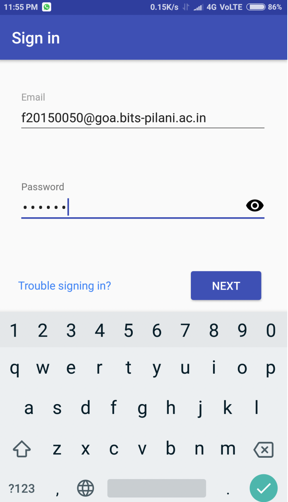
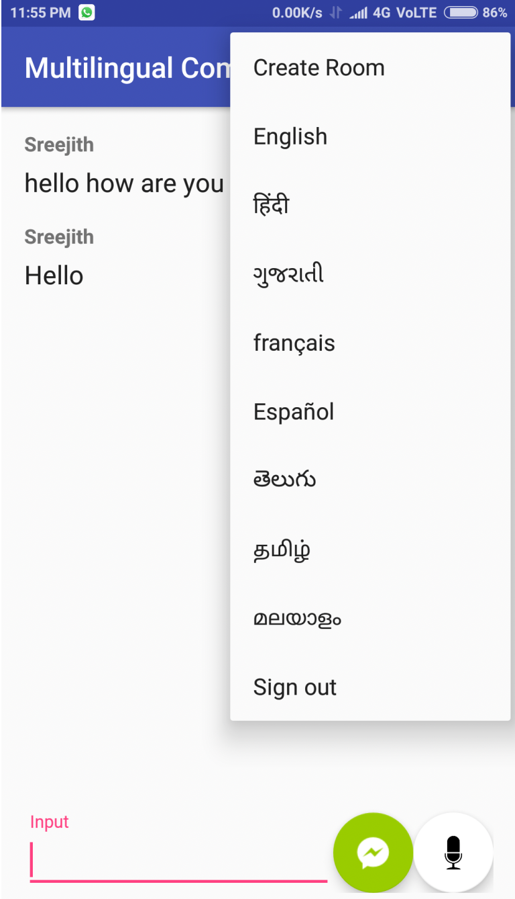
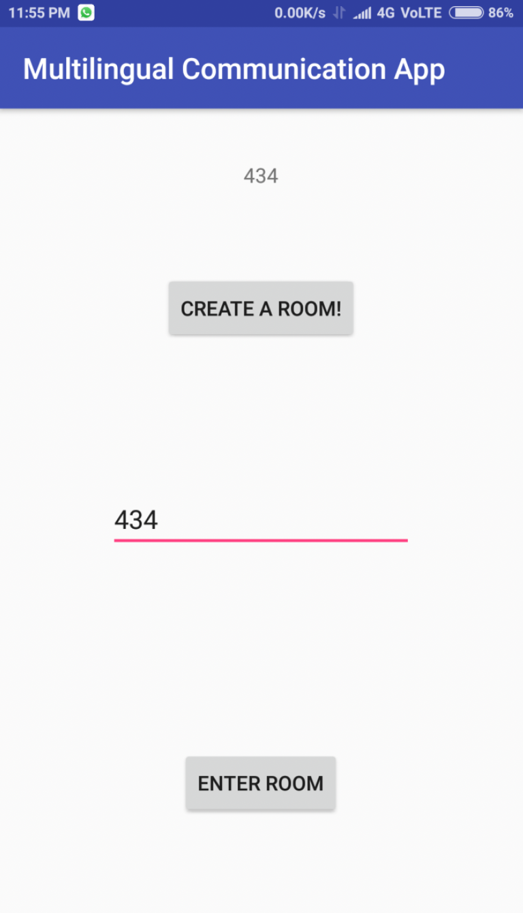
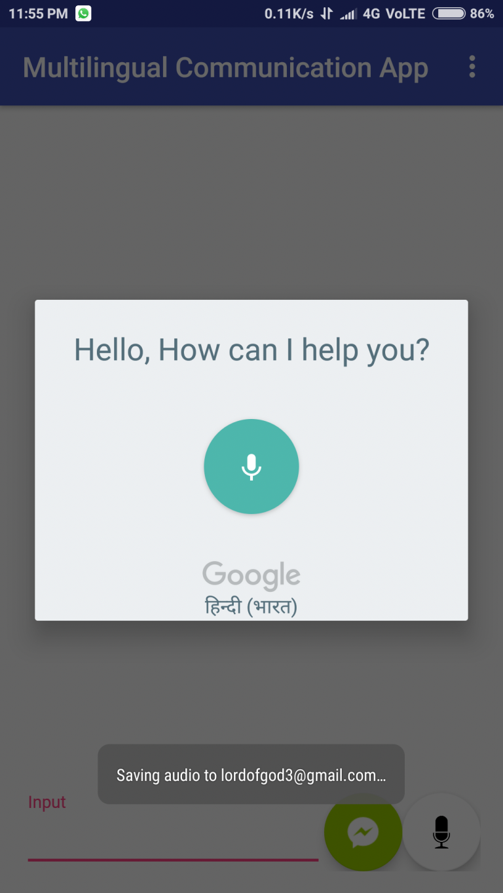
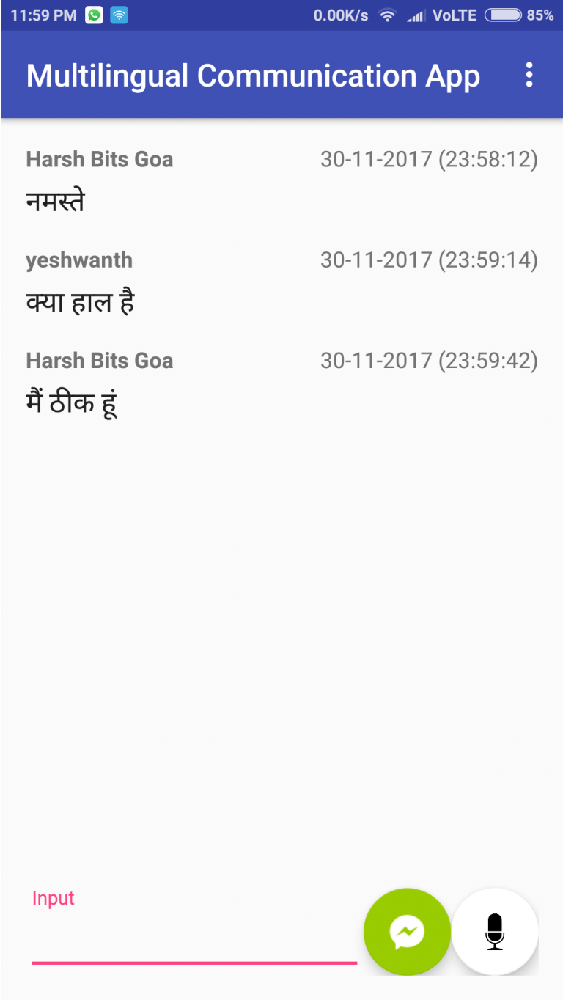
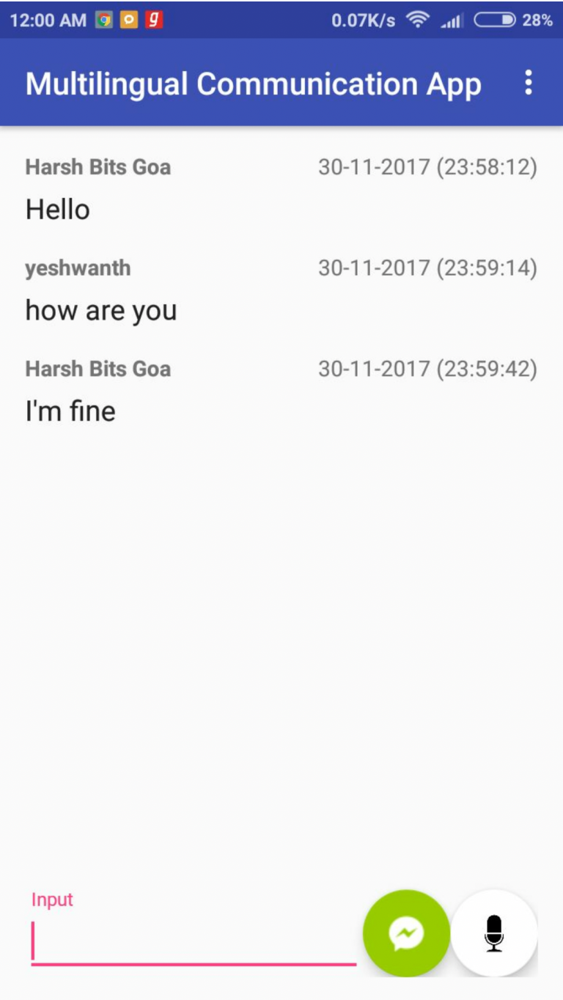

## Multilingual Chat Application
There are hundreds of languages spoken in India. This sometimes, makes it difficult for people sometimes to communicate when they don’t know a common language. Hence as a small step towards solving this problem, we have developed a chat application for android. 

In this application, a group of people speaking different languages can communicate with each other within private chat rooms in their own preferred language. The platform takes care of taking inputs in speech / text, and translates all the messages according to the receiver's preferred language.

This app bridges the language gap in India, allowing users who don't share a common language to communicate effectively.
### User Interface

#### Login

#### User selects language 

#### User creates a private chat room

#### User sends messages with speech

#### Sender sends messages in his preferred language

#### Reciever receives messages in his preferred language

